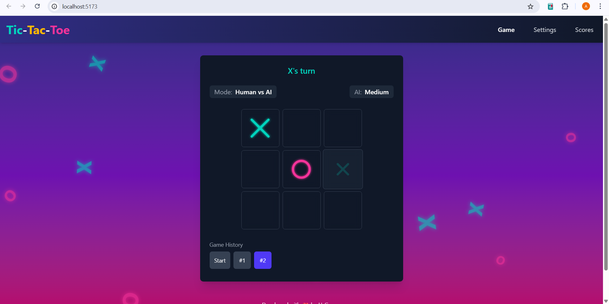
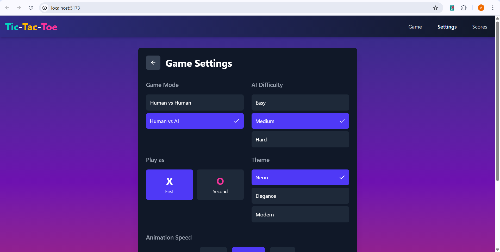
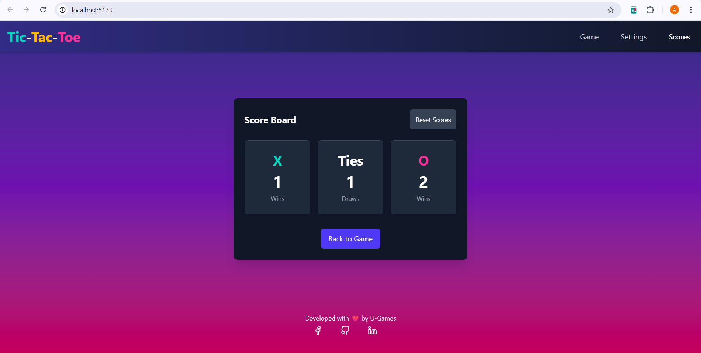
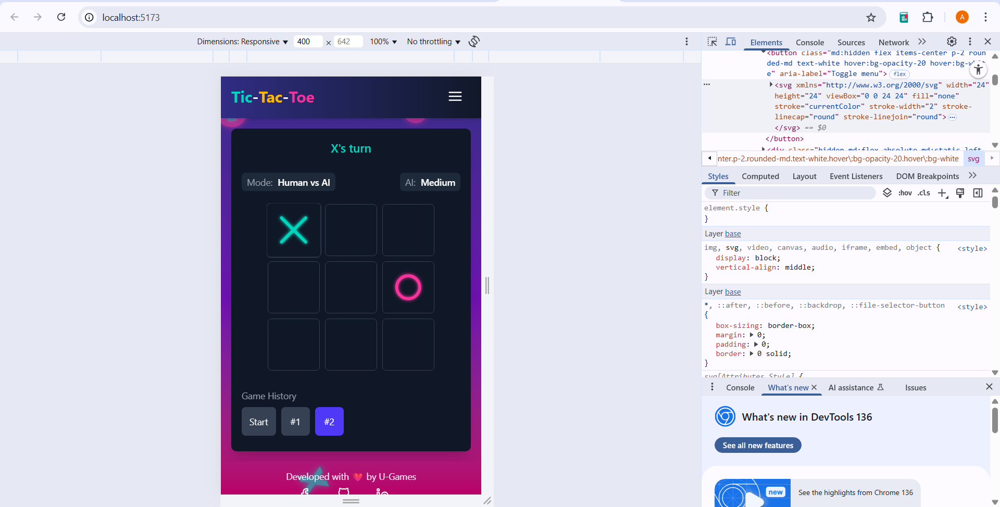

# Tic-Tac-Toe Game

<h2>📸 Game Previews</h2>

<p align="center">
  
  
</p>
<p align="center">
  
  
</p>


A modern, interactive Tic-Tac-Toe game built with React, TypeScript, and Tailwind CSS. This project demonstrates best practices in front-end development with a focus on user experience, clean code, and responsive design.

## 🎮 Features

- **Multiple Game Modes**:
  - Player vs Player
  - Player vs AI with adjustable difficulty levels (Easy, Medium, Hard)
  
- **Interactive UI**:
  - Animated game pieces
  - Background elements that interact with mouse movement
  - Game history navigation
  - Score tracking
  
- **Customization**:
  - Multiple themes (Neon, Elegance, Modern)
  - Play as X or O
  - Adjustable animation speed
  
- **Responsive Design**:
  - Fully responsive layout for all screen sizes
  - Touch-friendly for mobile devices

## 🛠️ Technologies

- **Core**:
  - React 18
  - TypeScript 5
  - Vite (for fast development and optimized builds)
  
- **Styling**:
  - Tailwind CSS
  - Custom CSS animations
  
- **State Management**:
  - React Context API
  - Custom hooks for game logic
  
- **Code Quality**:
  - ESLint
  - Prettier
  - TypeScript strict mode

## 🚀 Getting Started

### Prerequisites

- Node.js 16+ and npm installed

### Installation

1. Clone the repository:

```bash
git clone https://github.com/AsithaUdara/tic-tac-toe.git
cd tic-tac-toe
```

2. Install dependencies:

```bash
npm install
```

3. Start the development server:

```bash
npm run dev
```

4. Open your browser and visit: `http://localhost:5173`

### Building for Production

To create an optimized production build:

```bash
npm run build
```

The build files will be in the `dist` directory, ready to be deployed.

## 🏗️ Project Structure

```
tic-tac-toe/
├── src/
│   ├── assets/            # Static assets
│   ├── components/        # Shared/common components
│   ├── context/           # React context providers
│   ├── features/
│   │   └── game/          # Game feature module
│   │       ├── components/ # Game-specific components
│   │       └── hooks/     # Game-specific hooks
│   ├── styles/            # Global styles
│   ├── types/             # TypeScript type definitions
│   ├── App.tsx            # Main application component
│   └── main.tsx           # Application entry point
├── public/                # Public assets
├── index.html             # HTML entry point
├── package.json           # Project dependencies and scripts
├── tsconfig.json          # TypeScript configuration
├── tailwind.config.js     # Tailwind CSS configuration
└── vite.config.ts         # Vite configuration
```

## 🧠 Game Logic

The game implements a custom hook `useGameWithAI` that handles:

- Game state management
- Turn tracking
- Win/draw detection
- AI opponent logic with multiple difficulty levels
- Move history

The AI uses a combination of strategies:
- Hard difficulty: Implements minimax algorithm with optimal play
- Medium difficulty: Balances between optimal and random moves
- Easy difficulty: Uses mostly random moves with basic blocking

## 🎨 Themes and Customization

The game includes three distinct visual themes:
- **Neon**: Vibrant, glowing elements with a dark background
- **Elegance**: Clean, minimalist design with subtle animations
- **Modern**: Bold colors with a contemporary feel

Users can choose which symbol (X or O) they want to play as and adjust animation speed to their preference.

## 📱 Responsive Design

The game is designed to work seamlessly across devices:
- Desktop: Full experience with all animations
- Tablet: Optimized layout for medium-sized screens
- Mobile: Touch-friendly controls with adjusted sizing

## 🔧 Future Improvements

- Online multiplayer mode
- User accounts and persistent statistics
- More themes and customization options
- Tournament mode

## 🤝 Contributing

Contributions are welcome! Please feel free to submit a Pull Request.

1. Fork the project
2. Create your feature branch (`git checkout -b feature/new-feature`)
3. Commit your changes (`git commit -m 'Add some new feature'`)
4. Push to the branch (`git push origin feature/new-feature`)
5. Open a Pull Request

## 📄 License

This project is licensed under the MIT License - see the LICENSE file for details.

## 👨‍💻 Author

Developed with ❤️ by U-Games

Connect with me:
- [GitHub](https://github.com/AsithaUdara)
- [LinkedIn](https://www.linkedin.com/in/asithaudara)
- [Facebook](https://web.facebook.com/asitha.udara.161)